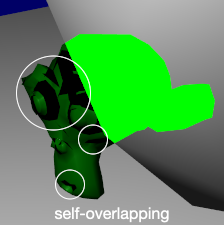
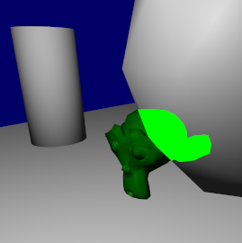

# Motivation

In the game [Fall Guys](https://www.youtube.com/watch?v=FcITAzKW3fY),
when a player is blocked by objects or other players,
the blocked part will be rendered in a special color.
With this feature, players can easily locate themselves even in a complicated scene.

After searching and obtaining advices from my friends,
I've achieved some similar effects.

# Algorithm

As shown in the following image,
the depth value of a fragment is used to render the different colors.

    if(player.z > scene.z)
        player.color = blockedColor;
    else
        player.color = originalColor;

The overall procedure is:

1.  Render the scene without the player to get its depth map (`scene.z`).

2.  Render the player the first time with `glDepthFunc(GL_LESS)` to get the original color.

3.  Render the player the second time with `glDepthFunc(GL_GREATER)` to get the blocked color.
    Especially, `discard` the fragment when `player.z < scene.z` to avoid the self-overlapped artifact.

In addition, `gl_FragCoord.z` represents the depth value of the current fragment.

# Result

In the image, the light green color represents the blocked part of the player.

# Reference

[1] LearnOpenGL: [Depth testing](https://learnopengl.com/Advanced-OpenGL/Depth-testing)

[2] Depth testing function: [glDepthFunc](https://www.khronos.org/registry/OpenGL-Refpages/gl4/html/glDepthFunc.xhtml)
