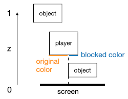

# Motivation

In the game [Fall Guys](https://www.youtube.com/watch?v=FcITAzKW3fY),
when a player is blocked by objects or other players,
the blocked part will be rendered in a special color.
With this feature, players can easily locate themselves even in a complicated scene.

After searching and obtaining advices from my friends,
I've achieved some similar effects.

# License

The MIT License (MIT)

Copyright (c) 2021, Jiang Ye

Permission is hereby granted, free of charge, to any person obtaining a copy of this software and associated documentation files (the "Software"), to deal in the Software without restriction, including without limitation the rights to use, copy, modify, merge, publish, distribute, sublicense, and/or sell copies of the Software, and to permit persons to whom the Software is furnished to do so, subject to the following conditions:

The above copyright notice and this permission notice shall be included in all copies or substantial portions of the Software.

THE SOFTWARE IS PROVIDED "AS IS", WITHOUT WARRANTY OF ANY KIND, EXPRESS OR IMPLIED, INCLUDING BUT NOT LIMITED TO THE WARRANTIES OF MERCHANTABILITY, FITNESS FOR A PARTICULAR PURPOSE AND NONINFRINGEMENT. IN NO EVENT SHALL THE AUTHORS OR COPYRIGHT HOLDERS BE LIABLE FOR ANY CLAIM, DAMAGES OR OTHER LIABILITY, WHETHER IN AN ACTION OF CONTRACT, TORT OR OTHERWISE, ARISING FROM, OUT OF OR IN CONNECTION WITH THE SOFTWARE OR THE USE OR OTHER DEALINGS IN THE SOFTWARE.

# Algorithm

As shown in the following image,
the depth value of a fragment is used to render the different colors.

    if(player.z > scene.z)
        player.color = blockedColor;
    else
        player.color = originalColor;

The overall procedure is:

1.  Render the scene without the player to get its depth map (`scene.z`).

2.  Render the player the first time with `glDepthFunc(GL_LESS)` to get the original color.

3.  Render the player the second time with `glDepthFunc(GL_GREATER)` to get the blocked color.
    Especially, `discard` the fragment when `player.z < scene.z` to avoid the self-overlapped artifact.

In addition, `gl_FragCoord.z` represents the depth value of the current fragment.

# Reference

[1] LearnOpenGL: [Depth testing](https://learnopengl.com/Advanced-OpenGL/Depth-testing)

[2] Depth testing function: [glDepthFunc](https://www.khronos.org/registry/OpenGL-Refpages/gl4/html/glDepthFunc.xhtml)
